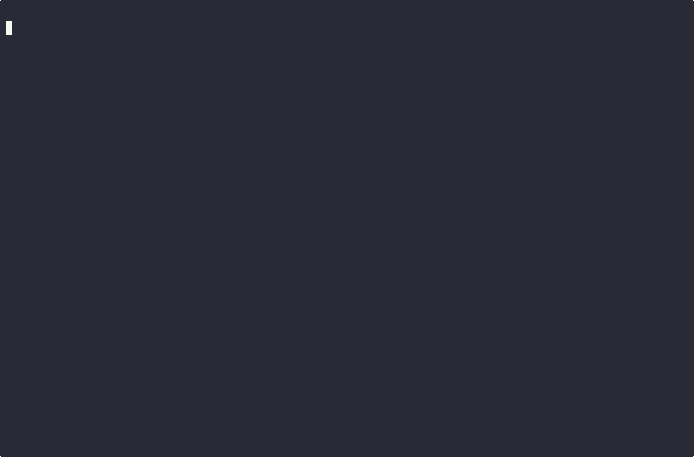

<p align="center"></p>

<p align="center">
  
  
  
  
</p>

# GitRaccoon

An AI-powered Git helper that generates branch names and commit messages using a
local [Ollama](https://ollama.com) model.

<p align="center"></p>

## 📦 Requirements

- [Deno](https://deno.com) v2+
- [Ollama](https://ollama.com) running locally (or on a reachable host)

## 🚀 Installation

Install `git-raccoon` globally via `deno install`:

```sh
deno install \
  --global \
  --name=git-raccoon \
  --allow-env=OLLAMA_HOST,OLLAMA_PORT,OLLAMA_MODEL,OLLAMA_TIMEOUT \
  --allow-net \
  --allow-run \
  jsr:@git-raccoon/cli
```

To update, run the same command with the `-f` argument (forces replacement).

To uninstall:

```sh
deno uninstall --global git-raccoon
```

## 🛠️ Commands

### `checkout`

Creates a new branch. If there are unstaged changes, the branch name is
generated by the LLM based on the diff. If there are no changes, a random name
is used (e.g. `hopeful-turing`).

```sh
git-raccoon checkout
```

### `commit`

Generates a
[Conventional Commits](https://www.conventionalcommits.org/en/v1.0.0/) message
from your staged changes and branch name, then prompts you to accept, edit, or
discard it.

```sh
git-raccoon commit
```

Stage everything and commit in one step with `-a`:

```sh
git-raccoon commit -a
```

## ⚙️ Configuration

The Ollama connection and model can be set via flags or environment variables.
Flags take precedence.

| Flag        | Environment variable | Default            |
| ----------- | -------------------- | ------------------ |
| `--host`    | `OLLAMA_HOST`        | `localhost`        |
| `--port`    | `OLLAMA_PORT`        | `11434`            |
| `--model`   | `OLLAMA_MODEL`       | `qwen2.5-coder:7b` |
| `--timeout` | `OLLAMA_TIMEOUT`     | `180` (seconds)    |

If the configured model is not available locally, it will be pulled
automatically.

### 🤖 Recommended models

| Hardware                   | Recommended model            |
| -------------------------- | ---------------------------- |
| 🖥️ With a dedicated GPU    | `qwen2.5-coder:7b` (default) |
| 💻 Without a dedicated GPU | `qwen2.5-coder:3b`           |

Find all available `qwen2.5-coder` sizes here: https://ollama.com/library/qwen2.5-coder

## 🔗 Git aliases

Add the following to your `~/.gitconfig` to use `git-raccoon` as native git
subcommands:

```gitconfig
[alias]
  aicommit = "!f(){ git-raccoon commit \"$@\"; }; f"
  aicheckout = "!f(){ git-raccoon checkout \"$@\"; }; f"
```

Then use:

```sh
git aicommit       # generate and commit
git aicommit -a    # stage all, then generate and commit
git aicheckout     # create a new AI-named branch
```

## 🙏 Credits

Many thanks to Martin Wimpress for his work on [faff](https://github.com/wimpysworld/faff) on which this project was heavily inspired.

## 🔍 Similar projects

| Project                                                         | Branch generation | Commit messages | Provider              |
| --------------------------------------------------------------- | :---------------: | :-------------: | --------------------- |
| [gitsloth](https://github.com/saccofrancesco/gitsloth)          |        ❌         |       ✅        | ☁️ Online LLM         |
| [agentsdance/aigit](https://github.com/agentsdance/aigit)       |        ❌         |       ✅        | ☁️ Online LLM         |
| [hardiksondagar/aigit](https://github.com/hardiksondagar/aigit) |        ❌         |       ✅        | ☁️ Online LLM         |
| [faff](https://github.com/wimpysworld/faff)                     |        ❌         |       ✅        | 🏠 Local (Ollama)     |
| [gitllama](https://github.com/brngdsn/gitllama)                 |        ❌         |       ✅        | 🏠 Local (Ollama)     |
| **git-raccoon**                                                 |      **✅**       |     **✅**      | 🏠 **Local (Ollama)** |

## 🧪 Development

Run without installing:

```sh
deno task run <command>
```
